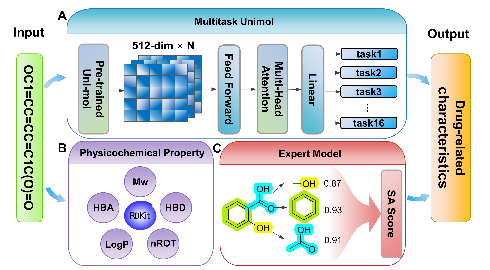

# Multitask Uni-Mol Project

This repository contains a multitask training pipeline based on the Uni-Mol framework. It includes code, data handling, and model checkpoint management for molecular property prediction tasks.



## Directory Overview

.
 ├── data/
 ├── main/
 └── saved_models/

### `data/`

This folder is used to store training and validation datasets. Please create a subfolder for each dataset, such as the example below:

data/
 └── seed_1847/
 └── seed_1847.csv

- The file `seed_1847.csv` is a **synthetic example** provided for format reference only.
- The model will automatically generate the following subfolders:
  - `evaluate/`: stores model evaluation results.
  - `intermediate/`: stores 3D processed data by Uni-Mol.
- The file `token_list.txt` in this folder is required by Uni-Mol during training. **Do not modify it unless necessary.**

### `main/`

This folder contains the full pipeline for training, validation, and testing.

- `model.py`: Implements the full training, validation, and evaluation workflow.
- `predictor.py`: Loads a trained model and generates predictions on new data.

### `saved_models/`

This folder stores trained model checkpoints. 

Ensure that the two model weights are correctly downloaded into the proper directory. Generally, using the Git repository's clone command will download both model weights correctly.

```
Mutitask_unimol\saved_models\pretrained\mol_pre_no_h_220816.pt
Mutitask_unimol\saved_models\trained\Multitask_Unimol_best.pt
```


## Training Instructions

To train a Uni-Mol model, use the following command:

```bash
python model.py --seed_dir seed_1847 --device cuda:1 --trial_version seed_1847_V3
```

`--seed_dir`: specifies the subfolder under `data/` that contains the training CSV.

`--device`: specifies the GPU device.

`--trial_version`: used to name the output model file.

### Output Paths

- Evaluation results will be saved in:
   `data/{seed_dir}/evaluate/`
- Trained model will be saved in:
   `saved_models/trained/{trial_version}_best.pt`

## Uni-Mol Installation Guide

Uni-Mol is built on DeepTech’s high-performance distributed framework, **Uni-Core**. It's recommended to install Uni-Core first before setting up Uni-Mol.

For example, with CUDA 11.3:

```bash
pip install torch==1.11.0+cu113 torchvision==0.12.0+cu113 torchaudio==0.11.0 --extra-index-url https://download.pytorch.org/whl/cu113
```

Then download and install Uni-Mol:

```bash
# Clone Uni-Mol repository
git clone https://github.com/dptech-corp/Uni-Mol.git
cd Uni-Mol/unimol

# Install as a package
pip install .
```

