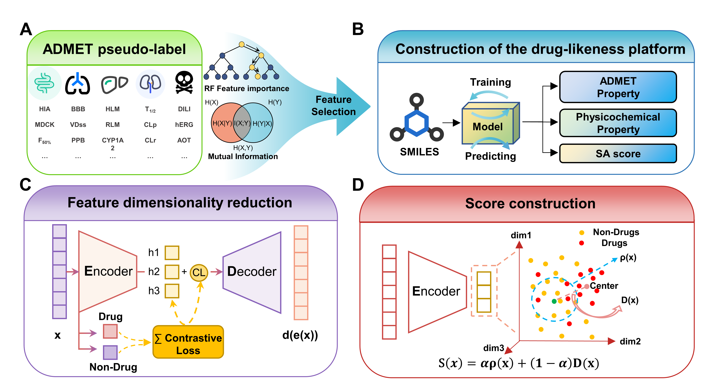

# CLaSP: A Contrastive Learning-Guided Latent Scoring Platform for Comprehensive Drug-Likeness Evaluation

This repository contains the implementation of the paper **CLaSP: A Contrastive Learning-Guided Latent Scoring Platform for Comprehensive Drug-Likeness Evaluation**.


## Web Service

We provide an online web-based platform for direct access:
**🌐 [https://lmmd.ecust.edu.cn/CLaSP](https://lmmd.ecust.edu.cn/CLaSP)**

### ⚠️ Notice on Access Restrictions
**We sincerely apologize for any inconvenience.**  
**Due to the server policy of East China University of Science and Technology (华东理工大学), this platform is accessible only between _8:00 AM and 8:00 PM Beijing Time (BJT)_.**  
**Outside of these hours, access is restricted to on-campus users only.**  
_This limitation is enforced by university policy and is not under our direct control. Thank you for your understanding._

## Repository Structure

This repository contains three main folders:

### 📁 CLVAE
Contains the complete implementation of the CLVAE (Contrastive Learning Variational Autoencoder) model used in the paper.
- Please refer to the README file within this folder for detailed usage instructions

### 📁 Mutitask_unimol  
Contains the implementation of the multi-task UniMol model used in the paper.
- Please refer to the README file within this folder for detailed usage instructions

### 📁 ROW_DATA
Contains drug-likeness related datasets used in the paper, including:

#### Pseudo-label Prediction Data
- `ROW_DATA/pseudo-label data/ADMETlab3.0/` - Pseudo-label prediction results based on ADMETlab3.0
- `ROW_DATA/pseudo-label data/admetSAR3.0/` - Pseudo-label prediction results based on admetSAR3.0

These datasets provide important annotation information for model training and evaluation.

## Usage Instructions

Each folder contains detailed README documentation. Please check the specific usage instructions for each module:
- See `CLVAE/README.md` for CLVAE model usage
- See `Mutitask_unimol/README.md` for multi-task UniMol model usage
- See `ROW_DATA/README.md` for detailed dataset information

## Citation

If you use this project in your research, please cite our paper:

```bibtex
@article{clasp2024,
  title={CLaSP: A Contrastive Learning-Guided Latent Scoring Platform for Comprehensive Drug-Likeness Evaluation},
  author={[Author Information]},
  journal={[Journal Information]},
  year={2024}
}
```

## Contact

For questions or suggestions, please contact us through:
- Visit our online platform: [https://lmmd.ecust.edu.cn/CLaSP](https://lmmd.ecust.edu.cn/CLaSP)
- Submit an issue to this repository
